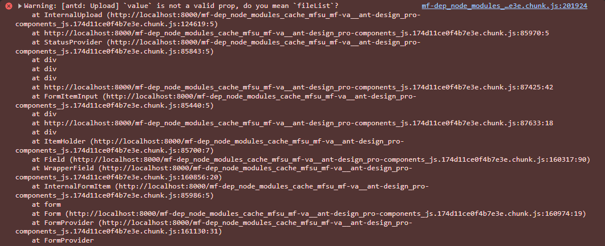
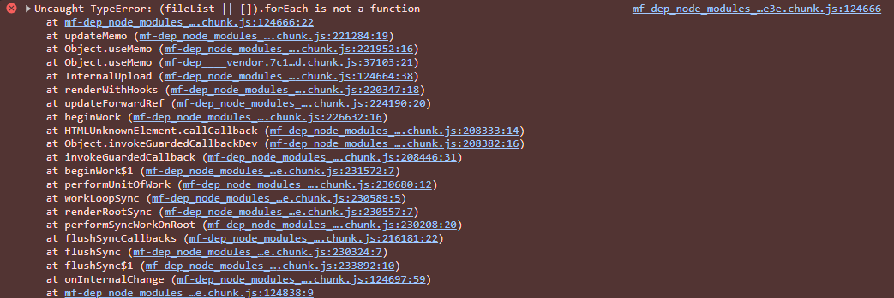

Form.Item 默认绑定数据到 value 上，需要重新绑定字段，同 Switch、CheckBox。

```TypeScript
<Form.Item
  label="选择文件"
  name="file"
  rules={[{ required: true, message: '请上传文件' }]}
  // valuePropName、getValueFromEvent
  valuePropName="fileList"
  getValueFromEvent={(e) => {
    console.log('Upload event:', e);
    if (Array.isArray(e)) {
      return e;
    }
    return e && e.fileList;
  }}
>
  <Upload {...uploadProps}>
    <Button style={{ margin: '0 10px' }} icon={<ImportOutlined />}>
      选择文件
    </Button>
  </Upload>
</Form.Item>
```

