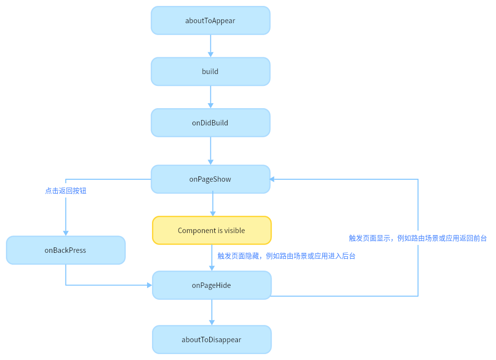

# 生命周期

**注意：页面 -> 组件**



对于嵌套组件，不同于主流 react、vue 的生命周期，arkts 中是完成 Parent 之后再去执行 Child。

页面：

1. onPageShow
2. onPageHide
3. onBackPress「返回」

组件：

1. aboutToAppear
2. onDidBuild
3. aboutToDisappear

# 注解

在 ArkTS（鸿蒙的 TypeScript 扩展）中，注解（Decorator）是一种特殊的语法，用于修饰类、方法、属性或参数，以改变它们的行为或提供额外的元数据。ArkTS 提供了一系列内置注解，用于开发鸿蒙应用。以下是 ArkTS 中常见的注解及其作用：


### 1. **组件相关注解**
#### `@Component`
- **作用**：标记一个类为自定义组件。
- **说明**：被 `@Component` 修饰的类会被视为一个 UI 组件，可以在 `build` 方法中定义组件的 UI 结构。
- **示例**：
  ```typescript
  @Component
  struct MyComponent {
    build() {
      Column() {
        Text('Hello, HarmonyOS!')
      }
    }
  }
  ```

#### `@Entry`
- **作用**：标记一个组件为应用的入口组件。
- **说明**：每个页面（Page）必须有一个 `@Entry` 修饰的组件，作为页面的根组件。
- **示例**：
  ```typescript
  @Entry
  @Component
  struct MainPage {
    build() {
      Column() {
        Text('Welcome to HarmonyOS!')
      }
    }
  }
  ```

#### `@Preview`
- **作用**：标记一个组件为可预览的组件。
- **说明**：在开发工具中，可以通过预览功能查看被 `@Preview` 修饰的组件的 UI 效果。
- **示例**：
  ```typescript
  @Preview
  @Component
  struct PreviewComponent {
    build() {
      Column() {
        Text('This is a preview component.')
      }
    }
  }
  ```

#### `@Reusable`
- **作用**：标记一个组件为可重用的组件。
- **说明**：被 `@Reusable` 修饰的组件会被系统缓存，避免重复创建，从而提升性能。
- **示例**：
  ```typescript
  @Reusable
  @Component
  struct ReusableComponent {
    build() {
      Column() {
        Text('I am reusable!')
      }
    }
  }
  ```

---

### 2. **状态管理相关注解**
#### `@State`
- **作用**：标记一个属性为组件的内部状态。
- **说明**：当 `@State` 修饰的属性发生变化时，组件会自动重新渲染。
- **示例**：
  ```typescript
  @Component
  struct StateExample {
    @State count: number = 0;

    build() {
      Column() {
        Text(`Count: ${this.count}`)
        Button('Increment')
          .onClick(() => {
            this.count++;
          })
      }
    }
  }
  ```

#### `@Prop`
- **作用**：标记一个属性为从父组件传递的属性。
- **说明**：`@Prop` 修饰的属性是单向绑定的，父组件更新时，子组件会自动更新。
- **示例**：
  ```typescript
  @Component
  struct ChildComponent {
    @Prop message: string;

    build() {
      Text(this.message)
    }
  }

  @Component
  struct ParentComponent {
    @State message: string = 'Hello from Parent!';

    build() {
      Column() {
        ChildComponent({ message: this.message })
        Button('Update Message')
          .onClick(() => {
            this.message = 'Message Updated!';
          })
      }
    }
  }
  ```

#### `@Link`
- **作用**：标记一个属性为与父组件双向绑定的属性。
- **说明**：`@Link` 修饰的属性在父组件和子组件之间是双向绑定的，任何一方的修改都会同步到另一方。
- **示例**：
  ```typescript
  @Component
  struct ChildComponent {
    @Link message: string;

    build() {
      Column() {
        Text(this.message)
        Button('Change Message')
          .onClick(() => {
            this.message = 'Message Changed by Child!';
          })
      }
    }
  }

  @Component
  struct ParentComponent {
    @State message: string = 'Hello from Parent!';

    build() {
      Column() {
        ChildComponent({ message: $message })
        Button('Update Message')
          .onClick(() => {
            this.message = 'Message Updated by Parent!';
          })
      }
    }
  }
  ```

#### `@Provide` 和 `@Consume`
- **作用**：用于跨组件层级的数据传递。
- **说明**：
  - `@Provide` 用于在父组件中提供数据。
  - `@Consume` 用于在子组件中消费数据。
- **示例**：
  ```typescript
  @Component
  struct ParentComponent {
    @Provide('message') message: string = 'Hello from Parent!';

    build() {
      Column() {
        ChildComponent()
      }
    }
  }

  @Component
  struct ChildComponent {
    @Consume('message') message: string;

    build() {
      Text(this.message)
    }
  }
  ```

---

### 3. **生命周期相关注解**
#### `@AboutToAppear`
- **作用**：标记一个方法为组件即将显示时的生命周期回调。
- **说明**：在组件即将显示时触发，适合用于初始化操作。
- **示例**：
  ```typescript
  @Component
  struct LifecycleExample {
    @AboutToAppear
    aboutToAppear() {
      console.log('Component is about to appear.');
    }

    build() {
      Column() {
        Text('Lifecycle Example')
      }
    }
  }
  ```

#### `@AboutToDisappear`
- **作用**：标记一个方法为组件即将消失时的生命周期回调。
- **说明**：在组件即将消失时触发，适合用于清理操作。
- **示例**：
  ```typescript
  @Component
  struct LifecycleExample {
    @AboutToDisappear
    aboutToDisappear() {
      console.log('Component is about to disappear.');
    }

    build() {
      Column() {
        Text('Lifecycle Example')
      }
    }
  }
  ```

---

### 4. **其他注解**
#### `@Observed`
- **作用**：标记一个类为可观察的类。
- **说明**：与 `@ObjectLink` 配合使用，用于观察对象属性的变化。
- **示例**：
  ```typescript
  @Observed
  class User {
    name: string;
    age: number;

    constructor(name: string, age: number) {
      this.name = name;
      this.age = age;
    }
  }

  @Component
  struct UserComponent {
    @ObjectLink user: User;

    build() {
      Column() {
        Text(`Name: ${this.user.name}`)
        Text(`Age: ${this.user.age}`)
      }
    }
  }
  ```

#### `@ObjectLink`
- **作用**：标记一个属性为对 `@Observed` 对象的引用。
- **说明**：用于观察对象的属性变化，并自动更新 UI。
- **示例**：
  ```typescript
  @Component
  struct ParentComponent {
    @State user: User = new User('Alice', 25);

    build() {
      Column() {
        UserComponent({ user: this.user })
        Button('Update Age')
          .onClick(() => {
            this.user.age++;
          })
      }
    }
  }
  ```

---

### 总结
ArkTS 中的注解主要用于以下方面：
1. **定义组件**：如 `@Component`、`@Entry`、`@Preview`。
2. **状态管理**：如 `@State`、`@Prop`、`@Link`、`@Provide`、`@Consume`。
3. **生命周期**：如 `@AboutToAppear`、`@AboutToDisappear`。
4. **数据观察**：如 `@Observed`、`@ObjectLink`。

# 组件

不同于 jsx、swp，arkts 中组件是以类的形式呈现的。

其 render 函数也有一定的变化，更接近与原始函数组件的写法。

```arkts
@Component
struct Com {
  build() {
    Column() {
      Button('click me')
        .width(20)
        .height(20)
    }
  }
}

```