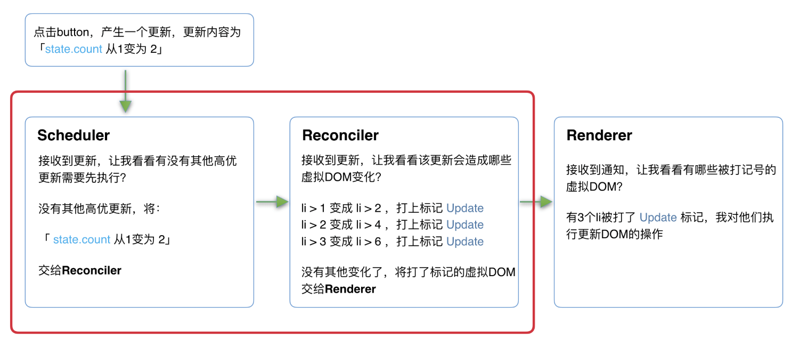

react 的设计理念：快速响应

cpu、io 瓶颈。

同步更新 -> 可中断的异步更新

react 15 架构：

1. Reconciler（协调器）—— 负责找出变化的组件
2. Renderer（渲染器）—— 负责将变化的组件渲染到页面上

Reconciler

render() -> JSX -> visual Dom -> diff -> has changed -> Renderer -> render

Reconciler -> Renderer -> Reconciler -> Renderer -> ...

交替执行。

react 15 的缺点：

同步执行，不中断更新。

由于存在递归执行，一旦递归过深，就会导致递归时间超过 16ms 页面就会出现卡顿。

这也是为什么，react 决定重构整个架构。

react 16 新架构：

1. Scheduler 调度器
2. Reconciler
3. Renderer

引入 Schedule 调度器 -> 任务是否中断。

其中 Schedule、Reconciler 可中断。

[Schedule](https://github.com/facebook/react/tree/1fb18e22ae66fdb1dc127347e169e73948778e5a/packages/scheduler)

虽然浏览器有[requestIdleCallback](https://developer.mozilla.org/zh-CN/docs/Web/API/Window/requestIdleCallback)，但由于一下因素，react并没有使用：

1. 浏览器兼容性
2. 触发不稳定「tab切换之后，触发的频率降的很低」

因此 react 实现了更完备的 Scheduler，其还提供多种调度优先级任务设置。

Reconciler

递归过程**可中断**。

每次循环都会调用shouldYield判断当前是否有剩余时间。

递归过程中会对存在更新的虚拟Dom，会给其打上[标签](https://github.com/facebook/react/blob/1fb18e22ae66fdb1dc127347e169e73948778e5a/packages/react-reconciler/src/ReactSideEffectTags.js)，后续会给到 Rerender 进行渲染到对应的平台。

```js
/** @noinline */
function workLoopConcurrent() {
  // Perform work until Scheduler asks us to yield
  while (workInProgress !== null && !shouldYield()) {
    workInProgress = performUnitOfWork(workInProgress);
  }
}

```

Reconciler -> while「shouldYield可中断」 -> visual Dom tag「update、Deletion...」

Rerender

根据 Reconciler 中标记的 visual Dom，同步执行对应的 Dom 操作。



其中红框中的步骤随时可能由于以下原因被中断：

1. 有其他更高优任务需要先更新
2. 当前帧没有剩余时间