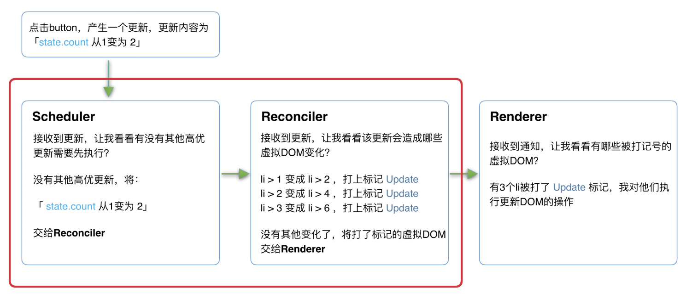

# 设计理念

react 的设计理念：快速响应

cpu、io 瓶颈。

同步更新 -> 可中断的异步更新

## react 15 架构

1. Reconciler（协调器）—— 负责找出变化的组件
2. Renderer（渲染器）—— 负责将变化的组件渲染到页面上

Reconciler

render() -> JSX -> visual Dom -> diff -> has changed -> Renderer -> render

Reconciler -> Renderer -> Reconciler -> Renderer -> ...

交替执行。

Reconciler采用递归的方式创建虚拟DOM，递归过程是不能中断的。如果组件树的层级很深，递归会占用线程很多时间，造成卡顿。

react 15 的缺点：

同步执行，不中断更新。

由于存在递归执行，一旦递归过深，就会导致递归时间超过 16ms 页面就会出现卡顿。

这也是为什么，react 决定重构整个架构。

## react 16 新架构

1. Scheduler - 调度器
2. Reconciler
3. Renderer

## Scheduler

引入 Schedule 调度器 -> 任务是否中断。

其中 Schedule、Reconciler 可中断。

可中断可以理解为：更新任务可中断，在可以继续的时候，恢复到之前执行的中间状态。

[Schedule](https://github.com/facebook/react/tree/1fb18e22ae66fdb1dc127347e169e73948778e5a/packages/scheduler)

虽然浏览器有[requestIdleCallback](https://developer.mozilla.org/zh-CN/docs/Web/API/Window/requestIdleCallback)，但由于一下因素，react并没有使用：

1. 浏览器兼容性
2. 触发不稳定「tab切换之后，触发的频率降的很低」

因此 react 实现了更完备的 Scheduler，其还提供多种调度优先级任务设置。

## Reconciler

递归过程**可中断**。

每次循环都会调用shouldYield判断当前是否有剩余时间。

递归过程中会对存在更新的虚拟Dom，会给其打上[标签](https://github.com/facebook/react/blob/1fb18e22ae66fdb1dc127347e169e73948778e5a/packages/react-reconciler/src/ReactSideEffectTags.js)，后续会给到 Rerender 进行渲染到对应的平台。

```js
/** @noinline */
function workLoopConcurrent() {
  // Perform work until Scheduler asks us to yield
  while (workInProgress !== null && !shouldYield()) {
    workInProgress = performUnitOfWork(workInProgress);
  }
}

```

Reconciler -> while「shouldYield可中断」 -> visual Dom tag「update、Deletion...」

## Rerender

根据 Reconciler 中标记的 visual Dom，同步执行对应的 Dom 操作。



其中红框中的步骤随时可能由于以下原因被中断：

1. 有其他更高优任务需要先更新
2. 当前帧没有剩余时间

# fiber 架构

## 代数效应

**react 中践行的就是代数效应**

**代数效应**是函数式编程中的一个概念，用于将副作用从函数调用中分离。

例如：

1. suspense - suspense 捕获异步组件将 promise 的状态。
2. hooks - useState 中数据在 react 中是如何保存更新的。

react fiber：react 内部实现的一套状态更新机制。支持任务不同优先级，可中断与恢复，并且恢复后可以复用之前的中间状态。

其中每个任务更新单元为React Element对应的Fiber节点。

## fiber

fiber 实际上就是俗称的虚拟dom「visual Dom」。

> fiber 的由来：
>
> 在React15及以前，Reconciler采用递归的方式创建虚拟DOM，递归过程是不能中断的。如果组件树的层级很深，递归会占用线程很多时间，造成卡顿。
>
> 为了解决这个问题，React16将递归的无法中断的更新重构为异步的可中断更新，由于曾经用于递归的虚拟DOM数据结构已经无法满足需要。于是，全新的Fiber架构应运而生。
>
> stack reconciler -> fiber reconciler
>
> fiber tree == dom tree
>
> fiber == react element

fiber

1. 基本信息 - fiber -> react element
2. 状态信息 - 更新、删除等

```js
function FiberNode(
  tag: WorkTag,
  pendingProps: mixed,
  key: null | string,
  mode: TypeOfMode,
) {
  /* 作为静态数据结构的属性 */
  /* Fiber对应组件的类型 Function/Class/Host... */
  this.tag = tag;
  // key属性
  this.key = key;
  /* 大部分情况同type，某些情况不同，比如FunctionComponent使用React.memo包裹 */
  this.elementType = null;
  /* 对于 FunctionComponent，指函数本身，对于ClassComponent，指class，对于HostComponent，指DOM节点tagName */
  this.type = null;
  /* Fiber对应的真实DOM节点 */
  this.stateNode = null;

  /* 用于连接其他Fiber节点形成Fiber树 */
  /* 父节点 */
  this.return = null;
  /* 子节点 */
  this.child = null;
  /* 右边的兄弟节点 */
  this.sibling = null;
  this.index = 0;

  this.ref = null;

  /* 作为动态的工作单元的属性 */
  /* 保存本次更新造成的状态改变相关信息 */
  this.pendingProps = pendingProps;
  this.memoizedProps = null;
  this.updateQueue = null;
  this.memoizedState = null;
  this.dependencies = null;

  this.mode = mode;

  /* 保存本次更新会造成的DOM操作 */
  this.effectTag = NoEffect;
  this.nextEffect = null;

  this.firstEffect = null;
  this.lastEffect = null;

  /* 调度优先级相关 */
  this.lanes = NoLanes;
  this.childLanes = NoLanes;

  /* 指向该fiber在另一次更新时对应的fiber - 「双指针」 */
  /* alternate 属性的主要作用是连接当前树和工作树，支持双缓存、节点复用以及状态和副作用的传递，从而提升 React 的渲染性能。 */
  this.alternate = null;

  /**
   * 当前fiber & 缓存中的fiber
   * currentFiber.alternate === workInProgressFiber;
   * workInProgressFiber.alternate === currentFiber;
   **/
}
```

**fiber tree**

主要通过这三个属性连接形成树结构。

```js
/* 父节点 */
this.return = null;
/* 子节点 */
this.child = null;
/* 右边的兄弟节点 */
this.sibling = null;
```

## 双缓存

类似在 canvas 中，每一帧的渲染前，都需要通过 `ctx.clearRect` 消除上一帧的画面。

如此，在当前帧计算时间过长，会导致出现白屏问题。

为解决这个问题，通常采用在内存中提前构建当前帧的画面，直接替换上一帧。

这种在内存中构建并直接替换的技术叫做**双缓存**，react dom 更新也是采用相同技术。

react 中最多有两个 fiber 树：

1. current fiber
2. workInProgress fiber

在 dom 发生变化时，通过交替这两颗树，达到快速更新的效果。

在次过程中 react 会尽可能的复用之前的 fiber 节点「复不复用取决于 diff 算法」，来减小开销。
